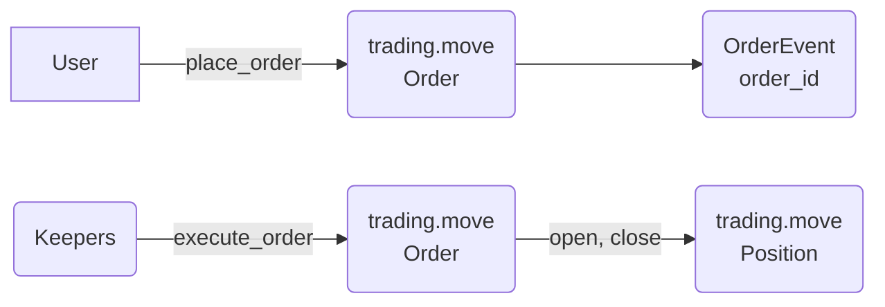
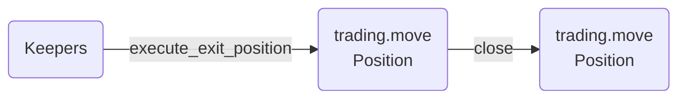
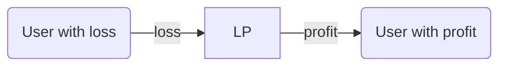
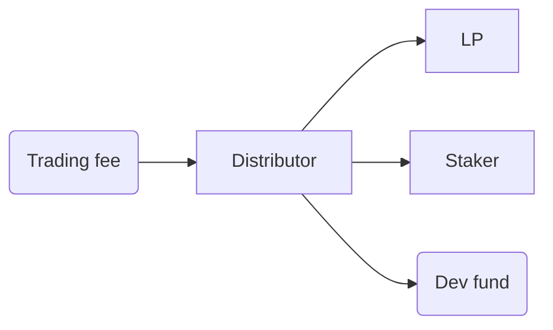

# Merkle Trade Contract

* [Merkle Trade](https://merkle.trade/)
* [Merkle Trade Docs](https://docs.merkle.trade/)
* [Merkle Trade Twitter](https://twitter.com/merkle_trade)
* Join us on the [Discord](https://discord.gg/GKyY4nqM)

## CLI Commands

_We recommend [Aptos CLI](https://github.com/aptos-labs/aptos-core/releases) above v2.0.1.

**Build**

```
aptos move compile
```

**Test**

```
aptos move test --coverage --ignore-compile-warnings
```

**Publish**

```
aptos move publish --assume-yes --included-artifacts none --max-gas 1000000
```

## Execution Flows

### Placing Orders (open, close position)

User may create a new `Order` by invoking the `place_order` function.

Once the `Order` is created, the keeper receives the `Order` creation event and executes the `Order` by invoking `execute_order` function with a real-time market price fetched from the Pyth price feed, transitioning the `Order` to a `Position`.

This two-step execution process ensures the orders are always executed with the real-time market price.

### Take Profit, Stop Loss, Liquidation


Once a position is created, it's monitored closely for changes in the asset's price by position keepers. When the asset's price hits either the take profit, stop loss, or liquidation prices, the `execute_exit_position` function is called by the position keepers.

### PnL Settlement


When handling a decrease order, PnL is determined by the change in asset price since the position was opened. 

When a trader experiences a loss, the LP receives a portion or the total amount of the collateral associated with the closed position. Conversely, when a trade closes positively, the LP pays out the profits to the user.

### Fee Settlement

Fees generated from trading are distributed to Merkle LP, Staker, and Dev Fund based on their respective weights.

## Contract Structure

### trading

`trading` directory contains the core modules mainly involved in trading. Specifically, the `trading.move` module stores all the data about each listed pair and the current state of the pair. For simplicity, all the utility functions for calculations are separated into the `trading_calc.move` file.

* [trading.move](sources/trading.move)
* [managed_trading.move](sources/managed_trading.move)
* [pair_types.move](sources/deployments/pair_types.move)
* [trading_calc.move](sources/trading_calc.move)

### house_lp

`house_lp` contains the modules that implement the Liquidity Pool. Liquidity providers can deposit into or withdraw from the LP through this module.

* [house_lp.move](sources/house_lp.move)
* [managed_house_lp.move](sources/managed_house_lp.move)

### oracles

`oracles` contains the modules that are responsible for the price feed used for trading.

* [price_oracle.move](sources/price_oracle.move)
* [managed_price_oracle.move](sources/managed_price_oracle.move)

### distributors

`distributors` contains the distributor module that distirbutes the fees to the liquidity pool, stakers, and the dev team as per the set weights.

* [fee_distributor.move](sources/fee_distributor.move)
* [managed_fee_distributor.move](sources/managed_fee_distributor.move)

### common

`common` directory contains the utility functions for integer calculations or the integration of Pyth and Switchboard.

* [safe_math_u64.move](sources/common/safe_math_u64.move)
* [pyth_scripts.move](sources/common/pyth_scripts.move)
* [switchboard_scripts.move](sources/common/switchboard_scripts.move)

### deployments

`deployments` directory contains the scripts used to set up the testnet environment. It will not be used on the mainnet and is intended to set up a basic test environment for deployments.

* [test_trading.move](sources/deployments/test_trading.move)
